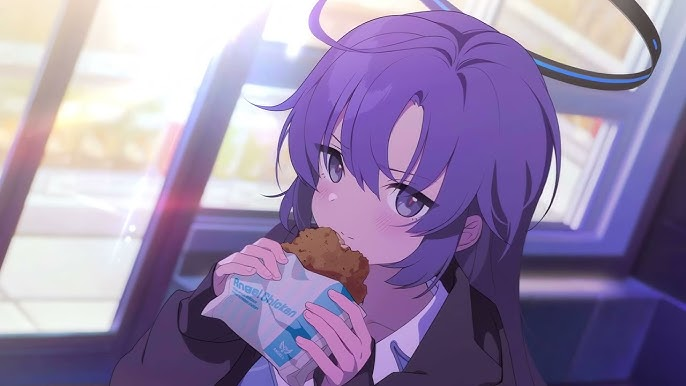

<!-- ⟡ finaea · Blue Archive themed profile ⟡ -->
<!-- Swap the banner/figure any time — drop your favorite student's render into the  slot marked below. -->

## ⟡ こんにちは、先生

ML engineer somewhere warm in **Kuala Lumpur** ☀️ — mostly teaching machines how to *hold a conversation* over a phone line

- 🎙️ I live in **realtime voice AI** — agents that listen, think, and reply in under 2 seconds, never leaves u on read
- 🧩 **Orchestrating multi-agent systems** + **MCP** that resolves your query just like jarvis  
- 🤝 Past life: **robotics (ROS)** and **VR + haptics** research — surgery-training sim
- 🔧 Weekends: Top Down Unity Game, optimizing daily life, and other slightly-cursed side quests
- ☕ Powered by Milo, blue UIs, and ASMRs

> *Currently advising Schale on latency-shaped problems.* Ping me if the call sounds laggy.

## ⟡ Kit

**Making agents talk**

**Languages & tools**

## ⟡ Logbook

⟡ thanks for stopping by, Sensei · <code>have a blue day (｡•ᴗ•｡)</code> ⟡

